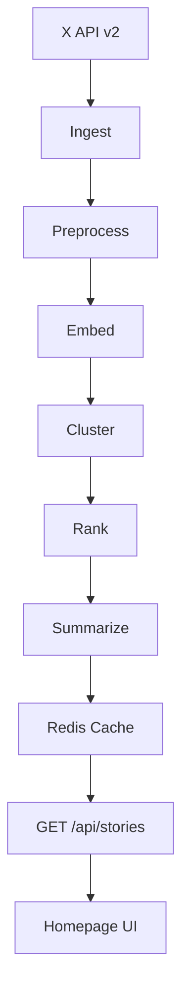
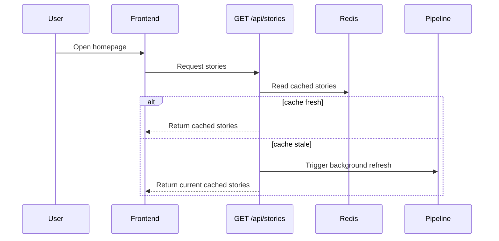

# X Stories

AI-curated news homepage for X.com — reimagining the logged-out experience.

**[Live Demo →](https://vikramxai.vercel.app)**

X Stories turns the logged-out X homepage into a modern editorial front page. Instead of showing isolated viral posts, it clusters live public conversations into emerging stories with AI-generated headlines, summaries, source posts, and momentum signals.

## Why

Tens of millions of people visit x.com logged out every day, but the current homepage doesn't convey what's actually happening across the platform. This project explores a different entry point: a live, AI-curated front page for the internet — built entirely from public conversations on X.

## Architecture

## Request Flow

## Pipeline

1. **Ingest** — Fetch public posts from X across 7 topic buckets (breaking, AI, tech, politics, business, culture, nearby)
2. **Preprocess** — Normalize text, deduplicate, extract hashtags and URLs
3. **Embed** — Generate vector embeddings with OpenAI `text-embedding-3-small`
4. **Cluster** — DBSCAN with cosine distance, then conservative URL/hashtag merge
5. **Rank** — Weighted score across engagement, velocity, recency, and author diversity
6. **Select** — Pick author-diverse representative posts per cluster
7. **Summarize** — Generate headline + summary with GPT-4o-mini
8. **Cache** — Persist to Redis with stale-while-revalidate serving

## Stack

| Layer | Technology |
| --- | --- |
| Framework | Next.js 16 (App Router) |
| Language | TypeScript, React 19 |
| Styling | Tailwind CSS v4 |
| Cache | Upstash Redis |
| Data | X API v2 |
| AI | OpenAI (embeddings + summarization) |

## API

| Route | Method | Purpose |
| --- | --- | --- |
| `/api/stories` | GET | Returns story feed + pipeline status; triggers refresh when stale |
| `/api/stories/refresh` | POST | Re-processes stories from cached tweets without calling the X API |

## Key Design Decisions

- **Story-first, not feed-first** — Conversations are grouped into narratives rather than shown as a raw stream
- **Cache-first serving** — Responses come from Redis; pipeline runs are fire-and-forget background tasks
- **Source-grounded** — Every story links back to real X posts, not just AI-generated text
- **Conversion-aware** — The logged-out experience complements the sign-up funnel with gated deeper exploration
- **Swappable LLM** — Summarization is model-agnostic and designed to work with Grok when API access is available

## Limitations

- Story IDs are not stable across pipeline runs (no deep linking yet)
- Single-process scheduling — production would use a platform scheduler (Vercel Cron, etc.)
- DBSCAN is O(n²), tuned for moderate batch sizes (~500 tweets)
- Nearby feed uses a hardcoded city rather than true geolocation
- No retry/backoff for rate-limited API calls

## Deep Dive

See [`docs/backend-architecture.md`](docs/backend-architecture.md) for the full backend writeup — cache behavior, failure handling, ranking formulas, and configuration reference.
